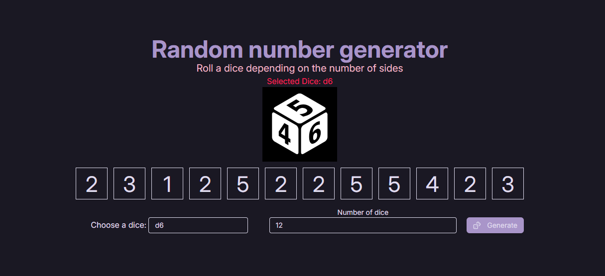
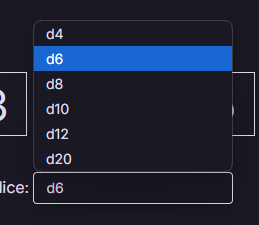
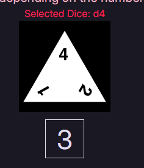
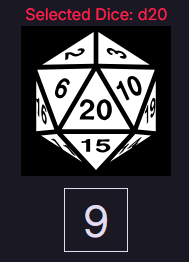

# DevProjects - Random number generator web app

This is an open source project from [DevProjects](http://www.codementor.io/projects). Feedback and questions are welcome!
Find the project requirements here: [Random number generator web app](https://www.codementor.io/projects/web/random-number-generator-web-app-bz042v8kll)

## Tech/framework used
Built with PHP, HTML, and Tailwind for styling

## Screenshots and demo
Screenshots of your app and/or a link to your live demo







## Installation
Instructions for other developers on how to install and run your code on their local environment.
Follow these steps to run the project locally:

1. **Clone the repository**
   ```bash
   git clone [this-repo-url]
   cd [this-repo-folder]
   php -S localhost:8000
2. **Clone the repository**
   Visit http://localhost:8000 and explore the app!

## License
[MIT](https://choosealicense.com/licenses/mit/)
Most open source projects use the MIT license. Feel free to choose whichever license you prefer.
